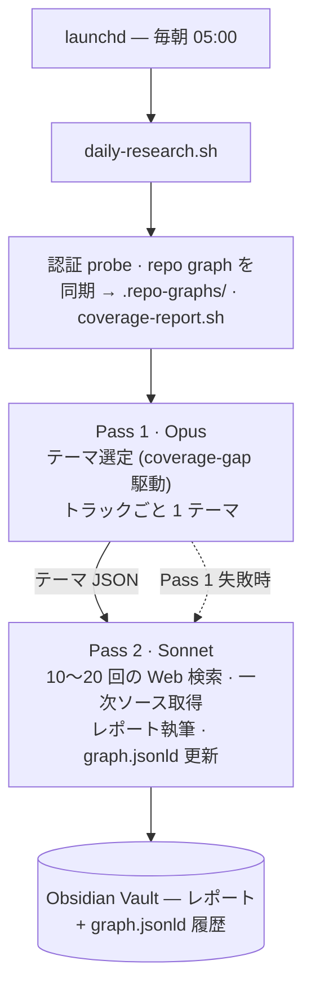

Language: [English](README.md) | 日本語

# daily-research

**自分の研究リポジトリのためのリサーチフィードバックエンジン。** 毎朝、[Claude Code](https://docs.anthropic.com/en/docs/claude-code) が、あなたが管理する各 repo の concept graph を読み込み、外部研究でまだ補強されていない concept を特定し、そのギャップを埋める最新研究をリサーチして、[Obsidian](https://obsidian.md) Vault にレポートを書き出します。各レポートの末尾には「この repo への寄与」節が付き、人間が手で元 repo に取り込めます。

[](LICENSE) [](https://deepwiki.com/shimo4228/daily-research) [](https://gitmcp.io/shimo4228/daily-research) 

macOS `launchd` で無人実行されます。API の配管もオーケストレーションフレームワークも不要 — shell スクリプトが Claude Code の非対話モード (`claude -p`) を駆動し、小さな stdlib のみの Python モジュールが JSON/TOML を解析します。知性はプロンプトに宿ります。

> **対象**: `graph.jsonld` concept graph を持つ研究リポジトリを 1 つ以上運用していて、汎用トレンドではなく repo の実際の coverage gap を狙った、日次・自律的な外部研究の流れが欲しい人。

## 仕組み



パイプラインは 2 つの Claude Code パスを実行します。**Opus** がテーマを選定し（repo graph 群への深い推論）、**Sonnet** が検索中心のリサーチと執筆を担います。Pass 1 が失敗した場合は Sonnet がテーマ選定も処理します。テーマはトレンドではなく **concept coverage** で駆動されます。`coverage-report.sh` が「repo の graph にある全 concept から `graph.jsonld` で補強済みの concept を引いた差分」を計算し、Pass 1 はそのギャップを埋める研究を優先します。トレンドは移ろいますが、未補強 concept は具体的で反復可能なターゲットです。

これはもともと汎用トレンドリサーチツールでした。固定トピックドメインが構造的飽和を招いた（1 つの concept クラスタが全トピックの 37% を占めた）ため、2026-05-27 に各トラックを 1 つの研究リポジトリにマッピングし直しました — 詳細は [ADR-0001](docs/adr/0001-research-repo-feedback-engine.md)。

## 中核概念

- **Coverage gap** — repo の graph にあるが `graph.jsonld` の `reinforces` にまだ記録されていない concept。テーマ選定の第一ターゲットで、Pass 2 が補強を記録するたびに縮小します。
- **フロンティア差分レポート (frontier-diff reporting)** — レポートは蓄積コンテンツの要約ではなく、repo の現在の concept frontier に対する *差分* です。テーマ選定を駆動するのと同じ signal-first フィルターの出力側双対です（[ADR-0002](docs/adr/0002-reports-as-frontier-diff.md)）。
- **Concept cluster graph** — `graph.jsonld`、schema.org JSON-LD の永続メモリ。レポートノードを 7 つの broad concept クラスタにまとめます。Pass 2 が実行ごとに増分更新します。スキーマは [graph-schema.md](docs/graph-schema.md)。
- **repo フィードバックループ** — repo は **read-only** 参照で、パイプラインは決して編集しません。寄与は人間が取り込む Vault レポート経由で流れ、repo 間汚染を回避します。

## 前提条件

| 要件 | 備考 |
|------|------|
| [Claude Code CLI](https://docs.anthropic.com/en/docs/claude-code) | `brew install claude` または npm 経由 |
| [Claude Max プラン](https://claude.ai) | 非対話モードをコスト0で利用するため |
| `python3` >= 3.11 | JSON/TOML 解析に stdlib のみ（`json` / `tomllib` / `re`）。macOS system 3.9 は `tomllib` 非対応のため Homebrew の `python3` を使う |
| macOS | スケジューリングに `launchd` を使用（Linux は `cron` / `systemd` に適宜変更） |
| Obsidian (任意) | Markdown 対応ツールなら何でも可 |
| 研究リポジトリ | `graph.jsonld` concept graph を持つ repo を 1 つ以上（[スキーマ](docs/graph-schema.md)） |

## クイックスタート

```bash
# 1. クローン
git clone https://github.com/shimo4228/daily-research.git daily-research
cd daily-research

# 2. 設定 — vault_path を設定し、各トラックを研究 repo にマッピング
cp config.example.toml config.toml

# 3. スクリプトに実行権限を付与
chmod +x scripts/*.sh

# 4. Claude の認証を確認（実 OAuth probe）
./scripts/check-auth.sh

# 5. (任意) 既存のトピック履歴から concept graph を bootstrap
./scripts/bootstrap-graph.sh

# 6. テスト実行 — 別ターミナルで。Claude Code セッション内では不可
./scripts/daily-research.sh

# 7. launchd でスケジュール (任意)
cp com.example.daily-research.plist com.daily-research.plist   # YOUR_USERNAME を編集
ln -sf "$(pwd)/com.daily-research.plist" ~/Library/LaunchAgents/
launchctl load ~/Library/LaunchAgents/com.daily-research.plist
```

**Claude Code skill としてインストール**: このリポジトリはルートに [`SKILL.md`](SKILL.md) マニフェストを備えているため、`~/.claude/skills/daily-research` へ clone すると `/daily-research` で呼び出せます。

## トラックの設定

各トラックは 1 つの研究リポジトリを指します。固定の `domains` はありません — 関心領域は実行時に repo の graph から導出されます。フィードしたい repo ごとに 1 トラックを定義します。

```toml
[tracks.repo_a]
name = "Research Repo A Contribution"
focus = "External research that reinforces and extends research repo A's concept system"
target_repo = "/path/to/your/research-repo-a"
target_graph = ".repo-graphs/repo_a.jsonld"   # 同期後の cwd 相対パス
target_doi = "10.xxxx/zenodo.xxxxxxxx"          # 任意; repo に DOI があれば
sources = ["Semantic Scholar (your repo's keywords)", "arXiv (relevant categories)"]
scoring_criteria = [
  { name = "Concept reinforcement", weight = 35, desc = "Reinforces an uncovered concept" },
  { name = "Research recency",      weight = 25, desc = "Latest research or development" },
  { name = "Repo frontier fit",     weight = 40, desc = "Serves the repo's next direction" },
]
```

レポートはデフォルトで日本語生成です。出力言語は `prompts/research-protocol.md` の言語制約を変更します。リサーチ深度の調整・CLI フラグ・環境変数は [CONTRIB](docs/CONTRIB.md) を参照。

## プロジェクト構成

```
daily-research/
├── scripts/
│   ├── daily-research.sh       # オーケストレータ (lib/ を source、preflight → Pass 1/2)
│   ├── lib/                    # sourced shell ライブラリ + Python 解析モジュール
│   │   ├── env.sh log.sh notify.sh lock.sh graph.sh auth.sh claude.sh
│   │   └── dr_pipeline.py      # JSON/TOML 解析の単一 stdlib モジュール
│   ├── coverage-report.sh      # 未補強 concept レポート、Pass 1 へ注入
│   ├── bootstrap-graph.sh      # graph.jsonld 初回 bootstrap (ワンショット、Opus clustering)
│   ├── check-auth.sh           # 実 OAuth probe ヘルスチェック (lib/auth.sh を共有)
│   └── pre-commit.sh           # secret / 構文ガード
├── prompts/                    # Pass 1 テーマ選定、Pass 2 タスク + リサーチプロトコル
├── templates/report-template.md
├── graph.jsonld                # 永続メモリ: concept cluster + 補強履歴
├── config.example.toml         # track → repo マッピング (config.toml は gitignore)
├── tests/                      # bats (daily-research / e2e-mock / lib) + pytest (dr_pipeline_test.py)
└── docs/                       # RUNBOOK, CONTRIB, graph-schema, adr/
```

## 主要な設計判断

| 判断 | 理由 |
|------|------|
| 各トラック = 1 研究 repo（coverage-gap 駆動） | 固定トピックドメインが構造的飽和を招いた; repo graph にマッピングしドメイン狭隘化を防ぐ（[ADR-0001](docs/adr/0001-research-repo-feedback-engine.md)） |
| レポート = フロンティア差分 | レポートは要約ではなく、repo の進化する concept graph に対する差分（[ADR-0002](docs/adr/0002-reports-as-frontier-diff.md)） |
| 外部 MCP メモリではなくローカル JSON-LD graph | 旧 Mem0 MCP 統合は静かな失敗で 32 日間ゼロ稼働した; ローカルファイルは失敗が顕在化する |
| 2パス (Opus + Sonnet) | テーマ選定は Opus が優位; リサーチ・執筆は Sonnet が高速かつ低コスト |
| repo は read-only 参照 | 寄与は人間が取り込む Vault レポート経由で流れ、repo 間汚染を回避 |
| Shell オーケストレーション + stdlib Python 解析 | ランタイムに pip 依存なし; JSON/TOML 解析を単一のテスト可能な `dr_pipeline.py` に集約 |

運用面の根拠（実 auth probe と `--version` の違い、`--append-system-prompt-file`、`--allowedTools`、`--max-turns`、`< /dev/null` stdin リダイレクト）は [CONTRIB](docs/CONTRIB.md) にあります。著者自身の運用では、daily-research は複数の研究ラインが共有する知識循環の *書き込み* 側としても機能しています — ロードマップではなく観察された稼働中のアーキテクチャです（[ADR-0003](docs/adr/0003-cross-line-knowledge-cycle.md)）。

## 注意事項

- **別ターミナルで実行** — `claude -p` は別の Claude Code セッション内にネストできません。
- **OAuth トークンは約4日で期限切れ** — `claude` を対話的に実行してリフレッシュ。実 auth probe が期限切れを再認証通知とともに loud に失敗させ、サイレントな double-fail を防ぎます。
- **`ANTHROPIC_API_KEY` は未設定であること** — 設定されていると Max プランではなくトークン単位課金になります。スクリプトが `unset` で対処します。
- **Claude Code プラグインがハングを引き起こす** — グローバルインストールされたプラグインは `claude -p` 呼び出しごとに MCP サーバーを初期化します。`.claude/settings.json` でプロジェクト単位で無効化してください（[RUNBOOK](docs/RUNBOOK.md) 参照）。
- **launchd は `.zshrc` を読み込まない** — 全 PATH エントリをスクリプトと plist に明示してください。

## ドキュメント

- [RUNBOOK](docs/RUNBOOK.md) / [日本語](docs/RUNBOOK.ja.md) — 運用: モニタリング、トラブルシューティング
- [CONTRIB](docs/CONTRIB.md) / [日本語](docs/CONTRIB.ja.md) — 開発: テスト、CLI フラグ、環境変数
- [graph-schema.md](docs/graph-schema.md) — `graph.jsonld` スキーマ: ノード型、クラスタ命名、整合性ルール
- [ADR-0001](docs/adr/0001-research-repo-feedback-engine.md) · [ADR-0002](docs/adr/0002-reports-as-frontier-diff.md) · [ADR-0003](docs/adr/0003-cross-line-knowledge-cycle.md) — アーキテクチャ決定記録

## ライセンス

[MIT](LICENSE)
