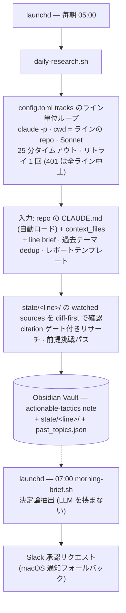

Language: [English](README.md) | 日本語

# daily-research

**自分の研究リポジトリの中で動くリサーチフィードバックエンジン。** 毎朝、[Claude Code](https://docs.anthropic.com/en/docs/claude-code) がライン (line) ごとに 1 回、*そのラインの repo を作業ディレクトリとして* 起動されます。repo 自身の運用文脈 — CLAUDE.md、タスク台帳、open questions、実施履歴 — を読み、**このラインを今すぐ前に進める実行可能な手** — 新 venue、新機構、期限付き機会、反証 — を探します。レポートは actionable-tactics note として [Obsidian](https://obsidian.md) Vault に書き出され、7:00 には決定論的な朝のブリーフが、その日の提案手を承認リクエストとして Slack に送ります。

[](LICENSE) [](https://deepwiki.com/shimo4228/daily-research) [](https://gitmcp.io/shimo4228/daily-research) 

macOS `launchd` で無人実行されます。API の配管もオーケストレーションフレームワークも不要 — shell スクリプトが Claude Code の非対話モード (`claude -p`) を駆動し、小さな stdlib のみの Python モジュールが JSON/TOML を解析します。知性はプロンプトに宿ります。

> **対象**: 研究リポジトリを 1 つ以上運用していて、汎用トレンドでも裏付けサーベイの山でもなく、repo の実際の次アクションを狙った、日次・自律的な外部研究の流れが欲しい人。

## 仕組み


```mermaid
flowchart TD
    cron["launchd — 毎朝 05:00"] --> orch["daily-research.sh"]
    orch --> loop["config.toml tracks のライン単位ループ<br/>claude -p · cwd = ラインの repo · Sonnet<br/>25 分タイムアウト · リトライ 1 回 (401 は全ライン中止)"]
    loop --> ctx["入力: repo の CLAUDE.md (自動ロード) + context_files<br/>+ line brief · 過去テーマ dedup · レポートテンプレート"]
    ctx --> run["state/&lt;line&gt;/ の watched sources を diff-first で確認<br/>citation ゲート付きリサーチ · 前提挑戦パス"]
    run --> out[("Obsidian Vault — actionable-tactics note<br/>+ state/&lt;line&gt;/ + past_topics.json")]
    out -.-> brief["launchd — 07:00 morning-brief.sh<br/>決定論抽出 (LLM を挟まない)"]
    brief --> slack["Slack 承認リクエスト<br/>(macOS 通知フォールバック)"]
```

オーケストレータ (`scripts/daily-research.sh`) は `config.toml` の `tracks` に定義されたラインをループします。各 **ライン** につき `claude -p` を 1 回実行します — 単一パス、モデルは Sonnet、25 分タイムアウト、transient 失敗時のリトライ 1 回（401 は全ライン中止）— 作業ディレクトリはラインの `target_repo` です。各 run は:

1. repo の文脈と state を読む — CLAUDE.md は自動ロード、config の `context_files`（タスク台帳・open questions・実施履歴）は明示的に Read;
2. `state/<line>/` の監視ソース（`watched-sources.md`、`playbook.md` — playbook は delta 更新のみ）を **diff-first** で確認する;
3. 最も価値ある対象を選ぶ — 実行可能性が第一、期限性が第二、反証性が第三;
4. **citation ゲート**付きでリサーチする: 引用する URL はすべて run 内で WebFetch 解決済みであること;
5. **前提挑戦パス**を実行する — 「我々の立場と矛盾・複雑化する知見」節は必須（anti-sycophancy）。加えて自己汚染ガード — 運用者自身の repo は外部シグナルとして数えない;
6. actionable-tactics note を vault に Write する（`{date}_{track}_{slug}.md`）。リードは「今すぐ実行可能な手」— 各手に手順 / 所要 / **失効条件** / gate 留意を付ける;
7. `state/<line>/` と `past_topics.json` を更新する。

目的関数は「**このラインを今すぐ前に進める、実行可能な手を見つける**」。裏付け (corroboration) を主旨とするテーマは禁止、証拠付き「本日 actionable なし」は正の一級出力、手数ノルマはありません。

これはもともと汎用トレンドリサーチツールでした。固定トピックドメインが構造的飽和を招いたため、2026-05-27 に各トラックを研究リポジトリにマッピングし直し（[ADR-0001](docs/adr/0001-research-repo-feedback-engine.md)）、concept-graph の coverage / frontier 機構（[ADR-0004](docs/adr/0004-line-restructuring-and-frontier-mode.md)）、4 repo 1:1 構成への回帰（[ADR-0007](docs/adr/0007-return-to-four-repo-concept-reinforcement.md)）を経て、2026-08-04 に中央 2 パス concept-graph パイプラインを全廃 — テーマ選定が裏付けサーベイに収束していたため — し、per-repo in-context research に移行しました（[ADR-0008](docs/adr/0008-per-repo-in-context-research.md)）。

## 中核概念

- **Actionable-tactics note** — レポート形式。リード節は「今すぐ実行可能な手」（1〜3 件。各手に手順 / 所要 / 失効条件 / gate 留意）。失効条件を書けない手は手ではなく、手が 0 件の日は「本日 actionable なし」を証拠付きで正直に書きます。
- **Diff-first パス** — 各ラインは `state/<line>/` に `watched-sources.md`（ソース + last-seen 状態）と `playbook.md`（日付付きの状況→行動集）を永続化します。run は last-seen 以降の差分だけを拾い、既知テーマの再サーベイは禁止。playbook は日付付き delta 更新のみで、全面書き直しはしません。
- **前提挑戦パス** — anti-sycophancy の対抗策。執筆前に各 finding へ反証方向の検索を行い、レポートは矛盾・複雑化する知見の節を必ず持ちます。見つからなければ、空振りした反証クエリを明記します。
- **Citation ゲート** — レポートに載る URL はすべて run 内で WebFetch 解決済みであること。未解決の参照は落とすか明示マークします。
- **鮮度第一 (freshness-first)** — LLM 界隈の知識は 1 週間スケールで陳腐化します。すべての claim に as-of 日付、すべての推奨に失効条件を付けます。
- **repo は read-only** — マッピングされた repo は決して編集されません。三層で強制: doctrine（プロトコル文言）+ 実行（書き込み先は vault / `state/` / `past_topics.json` のみ）+ permission 層（`--allowedTools` の Write/Edit を絶対パスで制限）。
- **朝のブリーフ** — 7:00 に `scripts/morning-brief.sh` が当日ノートの「今すぐ実行可能な手」節を決定論的に抽出し（LLM を挟まない）、vault の `wiki_notify` ヘルパ経由で Slack へ番号付き承認リクエストを送ります。承認は運用者の次の Claude セッションで行い、その時点で各 repo の deploy 前 gate が適用されます。
- **凍結アーカイブ** — 退役した concept-cluster graph `graph.jsonld` への増分は停止しました。過去データの読み出し用に残されています（[スキーマ](docs/graph-schema.md)）。

## 前提条件

| 要件 | 備考 |
|------|------|
| [Claude Code CLI](https://docs.anthropic.com/en/docs/claude-code) | `brew install claude` または npm 経由 |
| [Claude Max プラン](https://claude.ai) | 非対話モードをコスト0で利用するため |
| `python3` >= 3.11 | JSON/TOML 解析に stdlib のみ（`json` / `tomllib` / `re`）。macOS system 3.9 は `tomllib` 非対応のため Homebrew の `python3` を使う |
| macOS | スケジューリングに `launchd` を使用（Linux は `cron` / `systemd` に適宜変更） |
| Obsidian (任意) | Markdown 対応ツールなら何でも可 |
| 研究リポジトリ | run が読める運用文脈（CLAUDE.md、タスク台帳、open questions）を持つ repo を 1 つ以上 |

## クイックスタート

```bash
# 1. クローン
git clone https://github.com/shimo4228/daily-research.git daily-research
cd daily-research

# 2. 設定 — vault_path と self_signals を設定し、ライン (1 line = 1 repo) を定義
cp config.example.toml config.toml

# 3. スクリプトに実行権限を付与
chmod +x scripts/*.sh

# 4. Claude の認証を確認（実 OAuth probe）
./scripts/check-auth.sh

# 5. テスト実行 — 別ターミナルで。Claude Code セッション内では不可
./scripts/daily-research.sh

# 6. launchd でスケジュール (任意): 05:00 リサーチ + 07:00 朝のブリーフ
cp com.example.daily-research.plist com.daily-research.plist             # YOUR_USERNAME を編集
cp com.example.daily-research-brief.plist com.daily-research-brief.plist # YOUR_USERNAME を編集
ln -sf "$(pwd)/com.daily-research.plist" ~/Library/LaunchAgents/
ln -sf "$(pwd)/com.daily-research-brief.plist" ~/Library/LaunchAgents/
launchctl load ~/Library/LaunchAgents/com.daily-research.plist
launchctl load ~/Library/LaunchAgents/com.daily-research-brief.plist
```

**Claude Code skill としてインストール**: このリポジトリはルートに [`SKILL.md`](SKILL.md) マニフェストを備えているため、`~/.claude/skills/daily-research` へ clone すると `/daily-research` で呼び出せます。

## ラインの設定

各 `[tracks.X]` エントリは研究 **ライン (line)** で、`[[tracks.X.repos]]` エントリ 1 つで研究リポジトリ 1 つにマッピングされます。関心領域は、実行時に repo の中から読まれる repo 自身の運用文脈です。

```toml
[general]
vault_path = "/path/to/your/obsidian/vault"
output_dir = "daily-research"
# 自己汚染ガード: これらの文字列に一致する成果物は「外部シグナル」として
# 数えない (第三者による言及・採用の観測は正当)
self_signals = ["github.com/YOUR_GITHUB_HANDLE", "Your Name"]

[tracks.line_a]
name = "Research Line A 前進"
focus = "line A を今すぐ前に進める実行可能な手の発見 — 新 venue / 新機構 / 期限付き機会 / 反証"
aliases = ["old_track_a"]                        # 旧 track 名。履歴 dedup を継続する
context_files = [".notes/TASKS.md", "docs/manifesto.md"]  # repo 相対。Step 1 で Read、無ければ skip
sources = ["arXiv / Semantic Scholar (your keywords) — ただし手か反証になる場合のみ"]
scoring_criteria = [
  { name = "実行可能性",   weight = 45, desc = "調べた結果が、運用者が今週実行できる具体的な手になるか" },
  { name = "期限性・鮮度", weight = 25, desc = "期限付き機会か。1 週間で陳腐化する前に動く価値があるか" },
  { name = "反証性・前進性", weight = 30, desc = "repo の前提・open question を動かし、次の行動を変えるか" },
]

[[tracks.line_a.repos]]
key = "repo_a"
target_repo = "/path/to/your/research-repo-a"    # run の cwd になる (read-only)
target_doi = "10.xxxx/zenodo.xxxxxxxx"           # 任意
```

レポートはデフォルトで日本語生成です。出力言語は `prompts/repo-research-protocol.md` の言語制約を変更します。CLI フラグ・環境変数は [CONTRIB](docs/CONTRIB.md) を参照。

## プロジェクト構成

```
daily-research/
├── scripts/
│   ├── daily-research.sh       # オーケストレータ (ライン単位ループ: cwd = 各ラインの repo で claude -p)
│   ├── morning-brief.sh        # 07:00 承認ブリーフ — 決定論抽出、vault ヘルパ経由で Slack 送信
│   ├── lib/                    # sourced shell ライブラリ + Python 解析モジュール
│   │   ├── env.sh log.sh notify.sh lock.sh auth.sh claude.sh
│   │   └── dr_pipeline.py      # JSON/TOML の単一 stdlib モジュール (line-brief, past-themes, report-lint, metrics)
│   ├── check-auth.sh           # 実 OAuth probe ヘルスチェック (lib/auth.sh を共有)
│   └── pre-commit.sh           # secret / 構文ガード
├── prompts/repo-research-protocol.md  # per-repo リサーチプロトコル (--append-system-prompt-file 用)
├── templates/report-template.md       # actionable-tactics note フォーマット
├── state/                      # ラインごとの watched-sources / playbook / last-seen (gitignored)
├── graph.jsonld                # 退役 concept-graph パイプラインの凍結アーカイブ (docs/graph-schema.md)
├── config.example.toml         # line → repo マッピング (config.toml は gitignore)
├── tests/                      # bats (daily-research / e2e-mock / lib) + pytest (dr_pipeline_test.py)
└── docs/                       # RUNBOOK, CONTRIB, graph-schema, adr/
```

## 主要な設計判断

| 判断 | 理由 |
|------|------|
| per-repo in-context research: ラインごと Sonnet 単一パス、cwd = repo | 中央 2 パス concept-graph パイプラインは repo を同期 graph 越しにしか見られず、選定が gap 埋めサーベイに縮退した。「進めるべき価値」を知る運用文脈は repo の中にある（[ADR-0008](docs/adr/0008-per-repo-in-context-research.md)） |
| 目的関数 = 実行可能な手（概念補強ではなく） | 裏付け収束はベンチマーク実証済みの failure mode。手数ノルマより証拠付き「本日 actionable なし」が正しい（[ADR-0008](docs/adr/0008-per-repo-in-context-research.md)） |
| diff-first + 前提挑戦 + citation ゲートを run 構造に組み込む | survey-per-run は文書化された anti-pattern。追従 drift はプロンプトの意図でなく構造で防ぐ（[ADR-0008](docs/adr/0008-per-repo-in-context-research.md)） |
| repo は三層 (doctrine / 実行 / permission) で read-only | 寄与は人間が取り込む Vault ノート経由で流れ、repo 間汚染を回避 |
| 朝のブリーフは決定論 — 夜間ノートを LLM に読ませない | 夜間ノートは LLM 生成物 = untrusted テキスト。それを LLM に通して通知を書かせる経路は injection 面を増やす（[ADR-0008](docs/adr/0008-per-repo-in-context-research.md)） |
| ラインを研究 repo にマッピング | 固定トピックドメインが構造的飽和を招いた（[ADR-0001](docs/adr/0001-research-repo-feedback-engine.md)）。[ADR-0007](docs/adr/0007-return-to-four-repo-concept-reinforcement.md) 以降は 4 repo 1:1 |
| 外部 MCP メモリではなくローカル state ファイル | 旧 Mem0 MCP 統合は静かな失敗で 32 日間ゼロ稼働した; ローカルファイルは失敗が顕在化する |
| Shell オーケストレーション + stdlib Python 解析 | ランタイムに pip 依存なし; JSON/TOML 解析を単一のテスト可能な `dr_pipeline.py` に集約 |

運用面の根拠（実 auth probe と `--version` の違い、`--append-system-prompt-file`、パス制限付き `--allowedTools`、`--max-turns`、`< /dev/null` stdin リダイレクト）は [CONTRIB](docs/CONTRIB.md) にあります。著者自身の運用では、daily-research は複数の研究ラインが共有する知識循環の *書き込み* 側としても機能しています — ロードマップではなく観察された稼働中のアーキテクチャです（[ADR-0003](docs/adr/0003-cross-line-knowledge-cycle.md)）。自己改善ループ — ライン単位のレポート存在ゲート (ctl-015)、決定論的レポート lint (ctl-016)、`metrics.jsonl`、`DR-Expect:` 突合、`/dr-review` — は [ADR-0006](docs/adr/0006-self-improvement-loop-human-consumer.md) から維持されています。

## 注意事項

- **別ターミナルで実行** — `claude -p` は別の Claude Code セッション内にネストできません。
- **OAuth トークンは約4日で期限切れ** — `claude` を対話的に実行してリフレッシュ。実 auth probe が期限切れを再認証通知とともに loud に失敗させ、サイレントな double-fail を防ぎます。
- **`ANTHROPIC_API_KEY` は未設定であること** — 設定されていると Max プランではなくトークン単位課金になります。スクリプトが `unset` で対処します。
- **Claude Code プラグインがハングを引き起こす** — グローバルインストールされたプラグインは `claude -p` 呼び出しごとに MCP サーバーを初期化します。`.claude/settings.json` でプロジェクト単位で無効化してください（[RUNBOOK](docs/RUNBOOK.md) 参照）。
- **launchd は `.zshrc` を読み込まない** — 全 PATH エントリをスクリプトと plist に明示してください。

## ドキュメント

- [RUNBOOK](docs/RUNBOOK.md) / [日本語](docs/RUNBOOK.ja.md) — 運用: モニタリング、トラブルシューティング
- [CONTRIB](docs/CONTRIB.md) / [日本語](docs/CONTRIB.ja.md) — 開発: テスト、CLI フラグ、環境変数
- [graph-schema.md](docs/graph-schema.md) — 凍結アーカイブ `graph.jsonld` のスキーマ（過去データ用）
- [ADR-0001](docs/adr/0001-research-repo-feedback-engine.md) · [ADR-0002](docs/adr/0002-reports-as-frontier-diff.md) · [ADR-0003](docs/adr/0003-cross-line-knowledge-cycle.md) · [ADR-0004](docs/adr/0004-line-restructuring-and-frontier-mode.md) · [ADR-0005](docs/adr/0005-agent-systems-and-human-ai-publics-line-rebalance.md) · [ADR-0006](docs/adr/0006-self-improvement-loop-human-consumer.md) · [ADR-0007](docs/adr/0007-return-to-four-repo-concept-reinforcement.md) · [ADR-0008](docs/adr/0008-per-repo-in-context-research.md) — アーキテクチャ決定記録

## ライセンス

[MIT](LICENSE)
