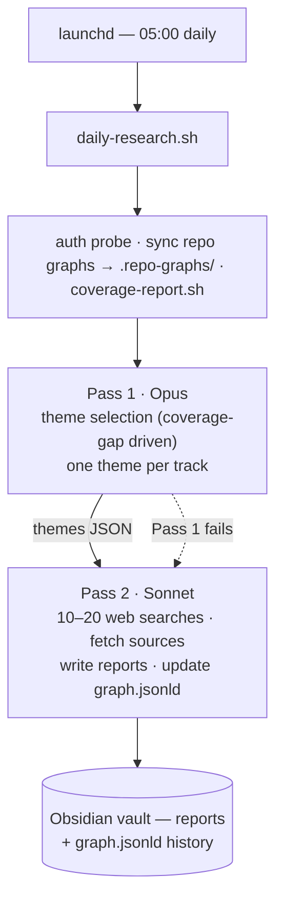

Language: English | [日本語](README.ja.md)

# daily-research

**A research feedback engine for your own research repositories.** Every morning, [Claude Code](https://docs.anthropic.com/en/docs/claude-code) reads the concept graph of each repo you maintain, finds the concepts external research hasn't reinforced yet, researches the latest work that closes those gaps, and writes reports into your [Obsidian](https://obsidian.md) vault — each ending with a "contribution to this repo" section you fold back in by hand.

[](LICENSE) [](https://deepwiki.com/shimo4228/daily-research) [](https://gitmcp.io/shimo4228/daily-research) 

It runs unattended via macOS `launchd`, with no API plumbing and no orchestration framework: a shell script drives Claude Code's non-interactive mode (`claude -p`), and a small stdlib-only Python module parses JSON/TOML. The intelligence lives in the prompts.

> **Who it's for:** anyone maintaining one or more research repositories with a `graph.jsonld` concept graph who wants a daily, self-directed stream of external research aimed at the repo's actual coverage gaps — not generic trends.

## How it works



The pipeline runs two Claude Code passes: **Opus** selects themes (deep reasoning over the repo graphs), then **Sonnet** does the search-heavy research and writing. If Pass 1 fails, Sonnet handles theme selection too. Themes are driven by **concept coverage**, not trends: `coverage-report.sh` computes "every concept in a repo's graph minus the concepts already reinforced in `graph.jsonld`", and Pass 1 prioritizes research that closes that gap. A trend is transient; an uncovered concept is a concrete, repeatable target.

This started as a generic trend-research tool. Fixed topic domains caused structural saturation (one concept cluster grew to 37% of all topics), so on 2026-05-27 each track was remapped to one research repository — see [ADR-0001](docs/adr/0001-research-repo-feedback-engine.md).

## Core concepts

- **Coverage gap** — a concept present in a repo's graph but not yet recorded under `reinforces` in `graph.jsonld`. Gaps are the primary targets of theme selection and shrink as Pass 2 records each reinforced concept.
- **Frontier-diff reporting** — a report is the *delta* against a repo's current concept frontier, not a digest of accumulated content. This is the output-side dual of the same signal-first filter that drives theme selection ([ADR-0002](docs/adr/0002-reports-as-frontier-diff.md)).
- **Concept cluster graph** — `graph.jsonld`, a schema.org JSON-LD persistent memory whose report nodes are grouped into 7 broad concept clusters; Pass 2 updates it incrementally each run. Schema in [graph-schema.md](docs/graph-schema.md).
- **Repo feedback loop** — repos are referenced **read-only**; the pipeline never edits them. Contributions flow through vault reports that a human folds back in, avoiding cross-repo pollution.

## Prerequisites

| Requirement | Notes |
|-------------|-------|
| [Claude Code CLI](https://docs.anthropic.com/en/docs/claude-code) | `brew install claude` or via npm |
| [Claude Max plan](https://claude.ai) | For zero-cost non-interactive usage |
| `python3` >= 3.11 | Stdlib only (`json` / `tomllib` / `re`) for JSON/TOML parsing. macOS system 3.9 lacks `tomllib`; use Homebrew's `python3` |
| macOS | Uses `launchd` for scheduling (Linux: adapt to `cron` / `systemd`) |
| Obsidian (optional) | Any markdown tool works |
| Research repositories | One or more repos carrying a `graph.jsonld` concept graph ([schema](docs/graph-schema.md)) |

## Quick start

```bash
# 1. Clone
git clone https://github.com/shimo4228/daily-research.git daily-research
cd daily-research

# 2. Configure — set vault_path and map each track to a research repo
cp config.example.toml config.toml

# 3. Make scripts executable
chmod +x scripts/*.sh

# 4. Verify Claude auth (real OAuth probe)
./scripts/check-auth.sh

# 5. (Optional) Bootstrap the concept graph from existing topic history
./scripts/bootstrap-graph.sh

# 6. Test run — in a SEPARATE terminal, never inside a Claude Code session
./scripts/daily-research.sh

# 7. Schedule with launchd (optional)
cp com.example.daily-research.plist com.daily-research.plist   # edit YOUR_USERNAME
ln -sf "$(pwd)/com.daily-research.plist" ~/Library/LaunchAgents/
launchctl load ~/Library/LaunchAgents/com.daily-research.plist
```

**Install as a Claude Code skill:** the repo ships a [`SKILL.md`](SKILL.md) manifest at root, so cloning it into `~/.claude/skills/daily-research` makes it invocable as `/daily-research`.

## Configure a track

Each track points at one research repository; there are no fixed `domains` — the area of interest is derived from the repo's graph at runtime. Define one track per repo you want fed.

```toml
[tracks.repo_a]
name = "Research Repo A Contribution"
focus = "External research that reinforces and extends research repo A's concept system"
target_repo = "/path/to/your/research-repo-a"
target_graph = ".repo-graphs/repo_a.jsonld"   # cwd-relative path after sync
target_doi = "10.xxxx/zenodo.xxxxxxxx"          # optional; the repo's DOI if it has one
sources = ["Semantic Scholar (your repo's keywords)", "arXiv (relevant categories)"]
scoring_criteria = [
  { name = "Concept reinforcement", weight = 35, desc = "Reinforces an uncovered concept" },
  { name = "Research recency",      weight = 25, desc = "Latest research or development" },
  { name = "Repo frontier fit",     weight = 40, desc = "Serves the repo's next direction" },
]
```

Reports are generated in Japanese by default; change the language constraint in `prompts/research-protocol.md`. See [CONTRIB](docs/CONTRIB.md) for tuning research depth, CLI flags, and environment variables.

## Project structure

```
daily-research/
├── scripts/
│   ├── daily-research.sh       # Orchestrator (sources lib/, preflight → Pass 1/2)
│   ├── lib/                    # Sourced shell libraries + the Python parsing module
│   │   ├── env.sh log.sh notify.sh lock.sh graph.sh auth.sh claude.sh
│   │   └── dr_pipeline.py      # Single stdlib-only JSON/TOML parsing module
│   ├── coverage-report.sh      # Uncovered-concept report, injected into Pass 1
│   ├── bootstrap-graph.sh      # One-shot graph.jsonld bootstrap (Opus clustering)
│   ├── check-auth.sh           # Real OAuth probe health check (shares lib/auth.sh)
│   └── pre-commit.sh           # Secret / syntax guard
├── prompts/                    # Pass 1 theme selection, Pass 2 task + research protocol
├── templates/report-template.md
├── graph.jsonld                # Persistent memory: concept clusters + reinforcement history
├── config.example.toml         # Track → repo mapping (config.toml is gitignored)
├── tests/                      # bats (daily-research / e2e-mock / lib) + pytest (dr_pipeline_test.py)
└── docs/                       # RUNBOOK, CONTRIB, graph-schema, adr/
```

## Key design decisions

| Decision | Why |
|----------|-----|
| Each track = one research repo (coverage-gap driven) | Fixed topic domains caused structural saturation; mapping to a repo graph prevents domain narrowing ([ADR-0001](docs/adr/0001-research-repo-feedback-engine.md)) |
| Reports as frontier-diff | A report is the delta against a repo's evolving concept graph, not a digest ([ADR-0002](docs/adr/0002-reports-as-frontier-diff.md)) |
| Local JSON-LD graph, not external MCP memory | The previous Mem0 MCP integration ran zero times for 32 days due to silent failure; a local file fails loudly |
| 2-pass (Opus + Sonnet) | Opus is stronger at theme selection; Sonnet is faster and cheaper for research and writing |
| Read-only repo reference | Contributions flow through vault reports a human folds back in, avoiding cross-repo pollution |
| Shell orchestration + stdlib Python parser | No pip dependencies at runtime; JSON/TOML parsing lives in one testable `dr_pipeline.py` module |

Operational rationale (real auth probe vs `--version`, `--append-system-prompt-file`, `--allowedTools`, `--max-turns`, `< /dev/null` stdin redirect) lives in [CONTRIB](docs/CONTRIB.md). In the author's own use, daily-research is also the *write* side of a knowledge cycle shared across several research lines — observed architecture, not a roadmap ([ADR-0003](docs/adr/0003-cross-line-knowledge-cycle.md)).

## Gotchas

- **Run in a separate terminal** — `claude -p` cannot be nested inside another Claude Code session.
- **OAuth token expires ~4 days** — refresh by running `claude` interactively. The real auth probe fails loudly with a re-auth notification instead of silently double-failing.
- **`ANTHROPIC_API_KEY` must be unset** — if set, Claude uses per-token billing instead of the Max plan. The script handles this with `unset`.
- **Claude Code plugins cause hangs** — globally-installed plugins initialize their MCP servers on every `claude -p` call. Disable them per-project in `.claude/settings.json` (see [RUNBOOK](docs/RUNBOOK.md)).
- **launchd doesn't source `.zshrc`** — all PATH entries must be explicit in the script and plist.

## Docs

- [RUNBOOK](docs/RUNBOOK.md) / [日本語](docs/RUNBOOK.ja.md) — operations: monitoring, troubleshooting
- [CONTRIB](docs/CONTRIB.md) / [日本語](docs/CONTRIB.ja.md) — development: testing, CLI flags, environment variables
- [graph-schema.md](docs/graph-schema.md) — `graph.jsonld` schema: node types, cluster naming, integrity rules
- [ADR-0001](docs/adr/0001-research-repo-feedback-engine.md) · [ADR-0002](docs/adr/0002-reports-as-frontier-diff.md) · [ADR-0003](docs/adr/0003-cross-line-knowledge-cycle.md) — architecture decisions

## License

[MIT](LICENSE)
