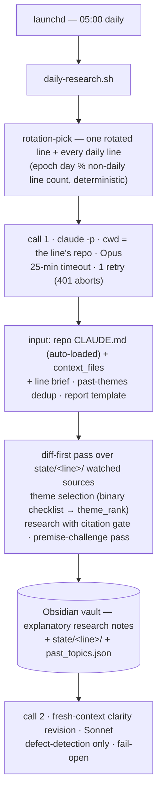

Language: English | [日本語](README.ja.md)

# daily-research

**A research feedback engine that runs inside your own research repositories.** Every morning, [Claude Code](https://docs.anthropic.com/en/docs/claude-code) is launched for one rotation-picked research line *with the line's repo as its working directory*. It reads the repo's own operational context — CLAUDE.md, task ledger, open questions, implementation log — and hunts for **external developments that move the repo's premises, questions, and positions**: new venues, new mechanisms, deadline-bound opportunities, refutations. Reports land in your [Obsidian](https://obsidian.md) vault as free-form explanatory notes written for a reader with zero prior context — something to read with your morning coffee, not a to-do queue. Deadline-bound opportunities are captured in a lightweight 機会メモ (opportunity memo) section at the end of each note.

[](LICENSE) [](https://deepwiki.com/shimo4228/daily-research) 

It runs unattended via macOS `launchd`, with no API plumbing and no orchestration framework: a shell script drives Claude Code's non-interactive mode (`claude -p`), and a small stdlib-only Python module parses JSON/TOML. The intelligence lives in the prompts.

> **Who it's for:** anyone maintaining one or more research repositories who wants a daily, self-directed stream of external research aimed at the repo's actual next action — not generic trends, and not a pile of corroborating surveys.

## How it works


```mermaid
flowchart TD
    cron["launchd — 05:00 daily"] --> orch["daily-research.sh"]
    orch --> pick["rotation-pick — one rotated line + every daily line<br/>(epoch day % non-daily line count, deterministic)"]
    pick --> loop["call 1 · claude -p · cwd = the line's repo · Opus<br/>25-min timeout · 1 retry (401 aborts)"]
    loop --> ctx["input: repo CLAUDE.md (auto-loaded) + context_files<br/>+ line brief · past-themes dedup · report template"]
    ctx --> run["diff-first pass over state/&lt;line&gt;/ watched sources<br/>theme selection (binary checklist → theme_rank)<br/>research with citation gate · premise-challenge pass"]
    run --> out[("Obsidian vault — explanatory research notes<br/>+ state/&lt;line&gt;/ + past_topics.json")]
    out --> clarity["call 2 · fresh-context clarity revision · Sonnet<br/>defect-detection only · fail-open"]
```

The orchestrator (`scripts/daily-research.sh`) picks **one rotated line per morning, plus every line marked `daily = true`** ([ADR-0011](docs/adr/0011-daily-line.md)). The rotation is deterministic over the non-daily lines defined in `config.toml` `tracks` (epoch day % non-daily line count — a 6-line rotation revisits each line every 6 days, [ADR-0010](docs/adr/0010-rotation-and-two-tier-eval.md)); daily lines run every day outside the cycle (`edge` since [ADR-0013](docs/adr/0013-edge-daily-line.md), 2026-08-20). For each picked line, call 1 runs `claude -p` once — model Opus, 25-minute timeout, one retry on transient failure (a 401 aborts the remaining lines while keeping finished results) — with the line's `target_repo` as the working directory. The run:

1. reads the repo's context and state — CLAUDE.md is auto-loaded; the config's `context_files` (task ledger, open questions, implementation log) are read explicitly;
2. makes a **diff-first pass** over the line's watched sources in `state/<line>/` (`watched-sources.md`, `playbook.md` — the playbook is delta-update only);
3. runs **theme selection**: generates 2–3 candidate themes, screens them with a binary checklist plus a refutation-pressure test, and records the named verdict as `theme_rank` in the note's frontmatter (A見込み / B見込み / Deepen後); weak-theme days are still written, rank-labeled — the eval is not a rejection gate;
4. researches with a **citation gate**: every cited URL must be resolved in-run via WebFetch;
5. runs a **premise-challenge pass**: every note must engage counter-evidence — external findings that contradict or complicate the repo's position — plus a self-contamination guard: the operator's own repos never count as external signals;
6. writes a free-form explanatory note to the vault (`{date}_{track}_{slug}.md`): a lead verdict, then a background explainer written for a reader with zero prior knowledge, then the specifics; deadline-bound opportunities go in a fixed 機会メモ tail section (what / where / **expiry date**);
7. updates `state/<line>/` and `past_topics.json`.

Call 2 then hands the finished note to a **fresh-context clarity reviewer** (`claude -p`, Sonnet, no research context, Edit restricted to the day's note): it reads as a first-contact reader, fixes comprehension stumbles span-by-span — defect detection only, no new facts — and its failure is fail-open (the unrevised note survives).

The objective function is "find external developments that move this repo's premises, questions, and positions — and deliver them as an explainer readable with zero prior context". Corroboration-as-theme is forbidden, "no change today" with evidence is a valid first-class output, and there is no discovery quota. Notes carry no proposals or approval requests ([ADR-0009](docs/adr/0009-explanatory-report-and-brief-retirement.md)).

This started as a generic trend-research tool. Fixed topic domains caused structural saturation, so on 2026-05-27 each track was remapped to a research repository ([ADR-0001](docs/adr/0001-research-repo-feedback-engine.md)); a concept-graph coverage/frontier machinery followed ([ADR-0004](docs/adr/0004-line-restructuring-and-frontier-mode.md)), then a return to four 1:1 repo lines ([ADR-0007](docs/adr/0007-return-to-four-repo-concept-reinforcement.md)). On 2026-08-04 the central 2-pass concept-graph pipeline was retired entirely — its theme selection had converged on corroboration surveys — in favor of per-repo in-context research ([ADR-0008](docs/adr/0008-per-repo-in-context-research.md)). On 2026-08-05, after the first full run, the output was converted from actionable-tactics notes with a Slack approval brief to free-form explanatory reports — the proposal framing had turned every note into a pending to-do ([ADR-0009](docs/adr/0009-explanatory-report-and-brief-retirement.md)). On 2026-08-13, after a `/dr-review` showed healthy production but a stalled consumption loop (5 reports/day exceeded both reading capacity and the sources' actual rate of change), daily all-line execution was replaced with one-line-per-day rotation plus a two-tier in-loop eval — theme selection and a fresh-context clarity revision ([ADR-0010](docs/adr/0010-rotation-and-two-tier-eval.md)).

## Core concepts

- **Explanatory report** — the report format ([ADR-0009](docs/adr/0009-explanatory-report-and-brief-retirement.md)): free-form body governed by five writing rules — lead with the verdict, background explainer for a zero-context reader, engage counter-evidence, include watched-source diffs, date every claim — plus two fixed machine-checked tail sections: 機会メモ (deadline-bound opportunities only: what / where / expiry date) and ソース (sources). No proposals, no approval requests.
- **Rotation + two-tier in-loop eval** — one rotated line per morning (plus `daily = true` lines every day, [ADR-0011](docs/adr/0011-daily-line.md)); theme candidates are screened with a binary checklist before writing (`theme_rank` ceiling), and a fresh-context second process revises the finished note for first-contact readability ([ADR-0010](docs/adr/0010-rotation-and-two-tier-eval.md)). Verdicts are consumed inside the same run — no scores are stored, keeping the human-consumer principle of [ADR-0006](docs/adr/0006-self-improvement-loop-human-consumer.md) intact.
- **Diff-first pass** — each line persists `watched-sources.md` (sources + last-seen state) and `playbook.md` (dated situation→action entries) in `state/<line>/`. Runs pick up only what changed since last-seen; re-surveying known themes is forbidden, and the playbook is updated by dated deltas only, never rewritten wholesale.
- **Premise-challenge pass** — an anti-sycophancy countermeasure: before writing, each finding is stress-tested for refuting evidence, and the report must engage counter-evidence against the repo's position. If nothing was found, the note states the counter-search queries that came up empty.
- **Citation gate** — every URL in a report must have been resolved via WebFetch during the run; unresolved references are dropped or explicitly marked.
- **Freshness-first** — knowledge in the LLM space goes stale on a one-week scale, so every claim carries an as-of date and every recommendation carries an expiry condition.
- **Read-only repos** — the mapped repos are never edited, enforced at three layers: doctrine (protocol wording), execution (writes go only to the vault, `state/`, and `past_topics.json`), and permissions (`--allowedTools` restricts Write/Edit to absolute paths).
- **Frozen archive** — `graph.jsonld`, the retired concept-cluster graph, receives no more increments; it is kept for reading historical data ([schema](docs/graph-schema.md)).

## Prerequisites

| Requirement | Notes |
|-------------|-------|
| [Claude Code CLI](https://docs.anthropic.com/en/docs/claude-code) | `brew install claude` or via npm |
| [Claude Max plan](https://claude.ai) | For zero-cost non-interactive usage |
| `python3` >= 3.11 | Stdlib only (`json` / `tomllib` / `re`) for JSON/TOML parsing. macOS system 3.9 lacks `tomllib`; use Homebrew's `python3` |
| macOS | Uses `launchd` for scheduling (Linux: adapt to `cron` / `systemd`) |
| Obsidian (optional) | Any markdown tool works |
| Research repositories | One or more repos whose operational context (CLAUDE.md, task ledger, open questions) the runs can read |

## Quick start

```bash
# 1. Clone
git clone https://github.com/shimo4228/daily-research.git daily-research
cd daily-research

# 2. Configure — set vault_path, self_signals, and define lines (one repo per line)
cp config.example.toml config.toml

# 3. Make scripts executable
chmod +x scripts/*.sh

# 4. Verify Claude auth (real OAuth probe)
./scripts/check-auth.sh

# 5. Test run — in a SEPARATE terminal, never inside a Claude Code session
./scripts/daily-research.sh

# 6. Schedule with launchd (optional): 05:00 research
cp com.example.daily-research.plist com.daily-research.plist             # edit YOUR_USERNAME
ln -sf "$(pwd)/com.daily-research.plist" ~/Library/LaunchAgents/
launchctl load ~/Library/LaunchAgents/com.daily-research.plist
```

**Install as a Claude Code skill:** the repo ships a [`SKILL.md`](SKILL.md) manifest at root, so cloning it into `~/.claude/skills/daily-research` makes it invocable as `/daily-research`.

## Configure a line

Each `[tracks.X]` entry is a research **line** mapped to one research repository via a `[[tracks.X.repos]]` entry. The area of interest is the repo's own operational context, read at runtime from inside the repo.

```toml
[general]
vault_path = "/path/to/your/obsidian/vault"
output_dir = "daily-research"
# Self-contamination guard: artifacts matching these strings never count as
# "external signals" (third-party mentions/adoptions of them are fine)
self_signals = ["github.com/YOUR_GITHUB_HANDLE", "Your Name"]

[tracks.line_a]
name = "Research Line A 前進"
focus = "Immediately executable moves that advance line A — new venues, mechanisms, deadline-bound opportunities, refutations"
aliases = ["old_track_a"]                        # legacy track names whose history keeps feeding dedup
context_files = [".notes/TASKS.md", "docs/manifesto.md"]  # repo-relative; read in Step 1; missing files are skipped
sources = ["arXiv / Semantic Scholar (your keywords) — only if it becomes a move or a refutation"]
scoring_criteria = [
  { name = "Executability",        weight = 45, desc = "Becomes a concrete move the operator can run this week" },
  { name = "Deadline / freshness", weight = 25, desc = "Time-bound; worth acting on before it goes stale (~1 week)" },
  { name = "Refutation / advance", weight = 30, desc = "Moves the repo's premises or open questions" },
]

[[tracks.line_a.repos]]
key = "repo_a"
target_repo = "/path/to/your/research-repo-a"    # becomes the run's cwd (read-only)
target_doi = "10.xxxx/zenodo.xxxxxxxx"           # optional
```

Reports are generated in Japanese by default; change the language constraint in `prompts/repo-research-protocol.md`. See [CONTRIB](docs/CONTRIB.md) for CLI flags and environment variables.

## Project structure

```
daily-research/
├── scripts/
│   ├── daily-research.sh       # Orchestrator (per-line loop: claude -p with cwd = each line's repo)
│   ├── lib/                    # Sourced shell libraries + the Python parsing module
│   │   ├── env.sh log.sh notify.sh lock.sh auth.sh claude.sh
│   │   └── dr_pipeline.py      # Single stdlib-only JSON/TOML module (line-brief, past-themes, report-lint, metrics)
│   ├── check-auth.sh           # Real OAuth probe health check (shares lib/auth.sh)
│   └── pre-commit.sh           # Secret / syntax guard
├── prompts/repo-research-protocol.md  # Per-repo research protocol (--append-system-prompt-file)
├── templates/report-template.md       # Explanatory-report writing rules + fixed tail sections
├── state/                      # Per-line watched-sources / playbook / last-seen (gitignored)
├── graph.jsonld                # FROZEN archive of the retired concept-graph pipeline (docs/graph-schema.md)
├── config.example.toml         # Line → repo mapping (config.toml is gitignored)
├── tests/                      # bats (daily-research / e2e-mock / lib) + pytest (dr_pipeline_test.py)
└── docs/                       # RUNBOOK, CONTRIB, graph-schema, adr/
```

## Key design decisions

| Decision | Why |
|----------|-----|
| Per-repo in-context research: one Sonnet pass per line, cwd = the repo | The central 2-pass concept-graph pipeline could only see repos through synced graphs, so selection degenerated into gap-filling surveys; the operational context that knows what to advance lives inside each repo ([ADR-0008](docs/adr/0008-per-repo-in-context-research.md)) |
| Objective = explanatory reports that move the repo's premises, not concept reinforcement | Corroboration-as-theme is a benchmarked failure mode ([ADR-0008](docs/adr/0008-per-repo-in-context-research.md)); the proposal/approval framing turned every note into a pending to-do, so notes are now reading material with a deadline-only 機会メモ tail ([ADR-0009](docs/adr/0009-explanatory-report-and-brief-retirement.md)) |
| Diff-first + premise-challenge + citation gate baked into the run structure | Survey-per-run is a documented anti-pattern; sycophantic drift needs structural countermeasures, not prompt intent ([ADR-0008](docs/adr/0008-per-repo-in-context-research.md)) |
| Repos are read-only at three layers (doctrine / execution / permissions) | Contributions flow through vault notes a human folds back in, avoiding cross-repo pollution |
| Lines map to research repositories | Fixed topic domains caused structural saturation ([ADR-0001](docs/adr/0001-research-repo-feedback-engine.md)); four 1:1 repo lines since [ADR-0007](docs/adr/0007-return-to-four-repo-concept-reinforcement.md) |
| Local state files, not external MCP memory | The previous Mem0 MCP integration ran zero times for 32 days due to silent failure; a local file fails loudly |
| Shell orchestration + stdlib Python parser | No pip dependencies at runtime; JSON/TOML parsing lives in one testable `dr_pipeline.py` module |

Operational rationale (real auth probe vs `--version`, `--append-system-prompt-file`, path-scoped `--allowedTools`, `--max-turns`, `< /dev/null` stdin redirect) lives in [CONTRIB](docs/CONTRIB.md). In the author's own use, daily-research is also the *write* side of a knowledge cycle shared across several research lines — observed architecture, not a roadmap ([ADR-0003](docs/adr/0003-cross-line-knowledge-cycle.md)). The self-improvement loop — per-line report-existence gate (ctl-015), deterministic report lint (ctl-016), `metrics.jsonl`, `DR-Expect:` reconciliation, `/dr-review` — is preserved from [ADR-0006](docs/adr/0006-self-improvement-loop-human-consumer.md).

## Gotchas

- **Run in a separate terminal** — `claude -p` cannot be nested inside another Claude Code session.
- **OAuth token expires ~4 days** — refresh by running `claude` interactively. The real auth probe fails loudly with a re-auth notification instead of silently double-failing.
- **`ANTHROPIC_API_KEY` must be unset** — if set, Claude uses per-token billing instead of the Max plan. The script handles this with `unset`.
- **Claude Code plugins cause hangs** — globally-installed plugins initialize their MCP servers on every `claude -p` call. Disable them per-project in `.claude/settings.json` (see [RUNBOOK](docs/RUNBOOK.md)).
- **launchd doesn't source `.zshrc`** — all PATH entries must be explicit in the script and plist.

## Docs

- [RUNBOOK](docs/RUNBOOK.md) / [日本語](docs/RUNBOOK.ja.md) — operations: monitoring, troubleshooting
- [CONTRIB](docs/CONTRIB.md) / [日本語](docs/CONTRIB.ja.md) — development: testing, CLI flags, environment variables
- [graph-schema.md](docs/graph-schema.md) — schema of the frozen `graph.jsonld` archive (historical data)
- [ADR-0001](docs/adr/0001-research-repo-feedback-engine.md) · [ADR-0002](docs/adr/0002-reports-as-frontier-diff.md) · [ADR-0003](docs/adr/0003-cross-line-knowledge-cycle.md) · [ADR-0004](docs/adr/0004-line-restructuring-and-frontier-mode.md) · [ADR-0005](docs/adr/0005-agent-systems-and-human-ai-publics-line-rebalance.md) · [ADR-0006](docs/adr/0006-self-improvement-loop-human-consumer.md) · [ADR-0007](docs/adr/0007-return-to-four-repo-concept-reinforcement.md) · [ADR-0008](docs/adr/0008-per-repo-in-context-research.md) — architecture decisions

## License

[MIT](LICENSE)
